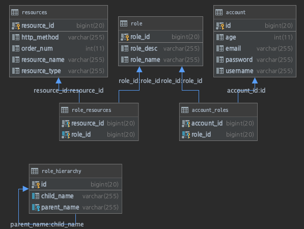

## DB 관리 기반 Security 프로젝트 

### 스프링 시큐리티 인가 개요
- DB와 연동하여 `자원` 및 `권한`을 설정하고 제어함으로 `동적 권한 관리`가 가능하도록 하는 것이 목표
- Spring 내에 존재하는 권한 관련 코드를 모두 제거

> 관리자 시스템 구축
- 회원관리: 권한 부여
- 권환관리: 권한 생성, 삭제
- 자원관리: 자원 생성, 삭제, 수정, 권한 매핑

> 권한 계층 구현
- URL: URL 요청 시 인가 처리
- Method: 메서드 호출 시 인가 처리
    - Method
    - PointCut

### URI 방식
> 주요 아키텍처 이해
- 시큐리티의 인가처리 방식을 살펴보고 필요한 DB 구조를 설계
```java
class SecurityConfig { // 시큐리티 설정 클래스
    public configure() { // 권한 설정 메서드
        // 사용자(인증정보)가 /user 자원(요청 정보)에 접근하기 위해서는 ROLE_USER 권한(권한 정보)가 필요하다.
        http.antMatchers("/user").access("hasRole('USER')");
    }
}
```

- `AccessDecisionManager` 접근 결정 관리자의 `decide()`

> 관리자 시스템 구성



> FilterInvocationSecurityMetadataSource
- 

> Map 기반 DB 연동
> 인가처리 실시간 반영하기
> PermitAllFilter
> 계층 권한 적용하기
> IP 접속 제한하기
